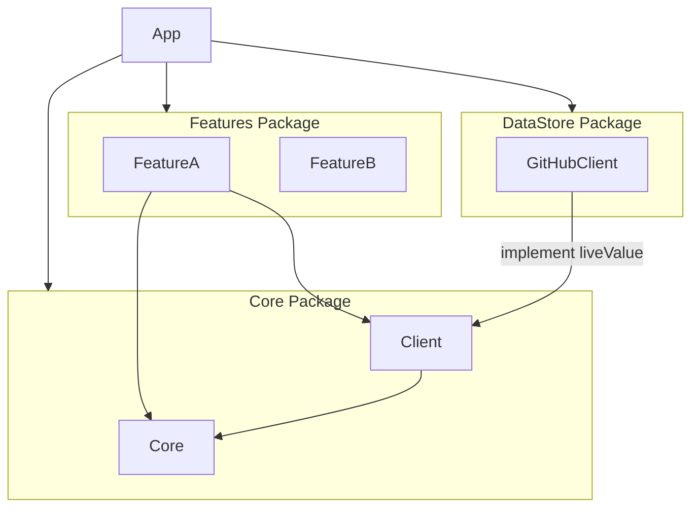

# gh-vision-app

GitHub Repository Viewer App for iOS

## 開発全般

### 開発を進める流れ

- [Milestones](https://github.com/daichikuwa0618/gh-vision-app/milestones) にマイルストーンをバージョンごとに作成 (例: v0.1.0, v1.2.0)
- マイルストーンに紐づく形で [GitHub Issues](https://github.com/daichikuwa0618/gh-vision-app/issues) を作成
- Issue をメンションする形で Pull Request を作成し、マージする
  - 必ずしも 1 Issue = I Pull Request である必要は無く、実装しやすい単位で Pull Request は作成する
  - Issue の対象の実装が完了した際は `close #xx` や `resolve #xx` でマージと連携して Issue を閉じるようにすると忘れないし、リンクされるので推奨
- マイルストーン対象の機能が全て完了したら `main` ブランチに tag を作成し、 GitHub Release を作成する

### ブランチ戦略

- [GitHub flow](https://githubflow.github.io/) に従う
  - ただし、v1.0.0 までは "*Anything in the master branch is deployable*" である必要は無い。
- `main` ブランチに向けて Pull Request を作成する
- v1.0.0 リリース後は必要に応じて Git-flow 等への変更を一度検討されたい

## 設計

- [swift-composable-architecture](https://github.com/pointfreeco/swift-composable-architecture) を利用する
- データアクセス層については DIP を行い、UI から直接 (間接的にも) 依存しないようにする
  - 以下の図も合わせて参照
  - Core においては `TestDependencyKey` のみに準拠させることで抽象として実装する
  - 具体は `DependencyKey` の準拠させ、Xcode Project 側で依存解決を行うことで、アプリ全体としてビルドするまではデータアクセス層に全く依存しないようにする

